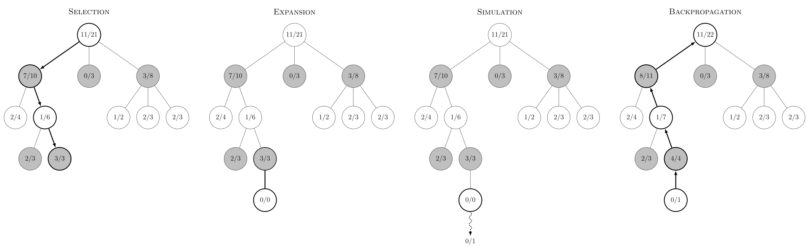

# Tic-Tac-Toe

## Documentation
The documentation of the important part of the code (namely all the scripts except the script for the GUI) have been built into HTML with sphinx, and hosted on GitHub pages. <br>
This documentation can be found here: https://tristan-amadei.github.io/TicTacToe-MCTS/

## How to play
##### Install dependencies
```sh
$ pip install -r requirements.txt
```

##### Laucnh the GUI
To launch the GUI, once the dependencies have been installed, just run the python code in Code/GUI.py. You will be prompted with a window containing a Tic-Tac-Toe grid. <br>
You have to select, at the bottom of the window, whether you want to play as X or O (you will always start first). <br>
To make a move, double-click on an empty square. Once you have played, the engine will activate automatically and play a response. <br>
You can take back a move by pressing the left directional arrow on your keyboard.

You may look at the gif below to see how the GUI looks like and how a game can be played. 

## Tic-Tac-Toe engine

I chose the game of Tic-Tac-Toe because it is simple and a position doesn't have a lot of possible game variants, unlike games like chess where the number of different positions becomes extremely high very quickly. 

The Monte-Carlo Tree Search method was implemented to code the engine that pays the game. <br>
On each position, the engine runs 5000 simulations.

I also added a GUI using pygame. The player can play with either the Xs or the Os, and the AI will take the others automatically. <br>
On this example, I was playing as O and the engine I was playing against was playing as X. As we can see on this very easy example, the engine was able to recognize the threats I made to win the game and it blocked me. It also seized the win when I let it win. </br> </br>


## Monte-Carlo Tree Search

**_Monte Carlo Tree Search (MCTS)_** is a heuristic search algorithm, known for its effectiveness in finding optimal solutions within large search spaces. <br/>

The MCTS algorithm builds a tree-like structure by iteratively exploring different paths in the search space. At each iteration, it selects a node in the tree, expands it by adding child nodes corresponding to possible actions, and then simulates random gameplay from these child nodes to evaluate their potential outcomes.

By repeating this process many times and updating the statistics of each node based on the simulation results, MCTS gradually focuses on the most promising actions and improves its decision-making capabilities. <br/><br/>
 <br/><br/>

### Exploration-Exploitation Tradeoff

MCTS employs a strategy called the exploration-exploitation tradeoff to balance between exploring new paths and exploiting known information to find optimal solutions within large search spaces.

One of the key components of MCTS is the Upper Confidence Bound on Trees (UCT) algorithm, which is used to select the most promising nodes in the search tree. 

$$UCT(node_i) = \frac{w_i}{n_i} + c \sqrt{\frac{ln N_i}{n_i}}$$ 
- $w_i$ : number of games after $node_i$was visited
- $n_i$ : number of visits of $node_i$
- $N_i$ : number of visits of the parents of $node_i$
- c : constant; usually, $c = \sqrt{2}$

The UCB algorithm calculates an exploration term that encourages exploration of less-visited nodes and an exploitation term that favors nodes with better statistical estimates.

The balance between exploration and exploitation is crucial for the effectiveness of MCTS. Initially, the algorithm tends to explore more to gain a broader understanding of the search space. As more simulations are performed, the exploitation term becomes dominant, and the algorithm focuses on exploiting the knowledge gained from previous explorations.
